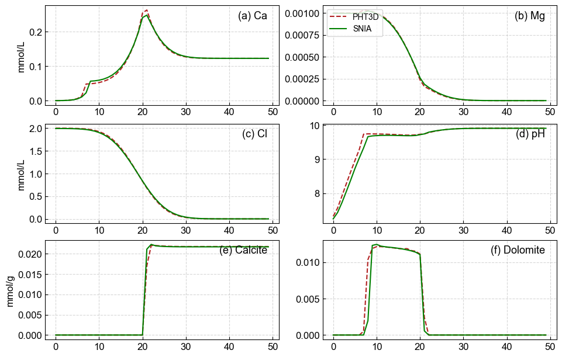

# mf6pqc

mf6pqc is a reactive transport framework that couples **MODFLOW6** with **PhreeqcRM**. It is designed to simulate the co-evolution of flow, solute transport, and chemical reactions in porous media. The framework provides two coupling strategies (**SNIA** and **SIA**) and supports feedback updates for porosity, permeability, diffusion coefficients, and density, making numerical simulations more consistent with real physical processes.

## Features

* **Solute Transport**: Managed by the MODFLOW6 **GWT** (Goundwater Transport) sub-model. It supports building independent GWT models for each chemical component and coupling them with the **GWF** (Groundwater Flow) model.
* **Chemical Reactions**: Executed by **PhreeqcRM**. At each time step, the concentration fields from GWT are packed and passed to PhreeqcRM. After running cell-based reactions, the updated concentrations and mineral contents are retrieved and written back to GWT.
* **Porosity Update**: Calculated based on the molar changes of minerals and their respective molar volumes.
* **Permeability Update**: Uses the **Kozeny–Carman** model by default to map porosity changes to permeability updates.
* **Diffusion Coefficient Update**: Utilizes a porosity-based tortuosity relationship $\tau = \phi^{1/3}$, where the effective diffusion coefficient is $D_e = \tau \cdot D_0$.
* **Density Feedback**: Scales the solution density provided by PhreeqcRM and feeds it back into the GWF **BUY** (Buoyancy) package, influencing the flow solution.

## Coupling Methods

* **SNIA (Sequential Non-Iterative Approach)**: Executes in a single sequence per time step: Transport → Reaction → Write-back → Parameter Feedback. It does not iteratively correct source terms within the same time step.
* **SIA (Sequential Iterative Approach)**: Performs **Picard iterations** within a single time step. It corrects GWT source terms (using the GWT **SRC** package) based on reaction results until the convergence criteria are met.

## Example Run: PHT3D_E02

1. **Install dependencies**: `pip install -r requirements.txt`.
2. **Place MODFLOW6 binaries**: Put the MODFLOW6 binaries in the `bin` folder. The example defaults to `./bin/mf6.7.0/mf6.exe` and `./bin/mf6.7.0/libmf6.dll`. Please ensure the corresponding versions are placed in this directory.
3. **Execute from the root directory**: `python examples/PHT3D_E02/run.py`
4. **Workflow**: The script initializes the chemistry module, sets initial conditions based on `ic_mapping`, builds and writes the GWF/GWT models, runs the standard coupling loop via `simulator.run()`, saves results with `simulator.save_results()`, and finally releases resources.
5. **Output**: Results are located in `examples/PHT3D_E02/output/`, including `results.npy` and other files.
6. **SIA Mode**: In `run.py`, comment out `simulator.run()` and enable `simulator.run_SIA()`. Run the script again to use the SIA loop.

## Scope and Extension

* **mf6pqc** is suitable for 1D to 3D reactive transport simulations.
* **Extensibility**: Supports adding new mineral species, replacing permeability models, and introducing more complex boundary conditions or source term settings.