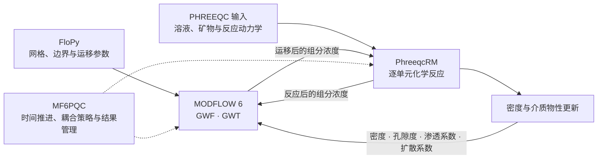

<p align="center">
  
</p>
<p align="center">A modular MODFLOW 6–PhreeqcRM framework for variable-density reactive transport with evolving porosity and hydraulic conductivity</p>

<p align="center">
  <a href="https://pypi.org/project/mf6pqc/"></a>
  <a href="pyproject.toml"></a>
  <a href="https://github.com/MODFLOW-ORG/modflow6/releases/tag/6.8.0"></a>
  <a href="LICENSE"></a>
</p>

<p align="center">
  <a href="#快速开始">快速开始</a> ·
  <a href="#案例与论文图">案例与论文图</a> ·
  <a href="#复现绘图">复现绘图</a> ·
  <a href="#扩展自己的模型">扩展自己的模型</a>
</p>

MF6PQC 将 MODFLOW 6 的地下水流动与溶质运移连接到 PhreeqcRM 的地球化学计算，保留 FloPy 和 PHREEQC 的建模方式。通过 SNIA、SIA 或 Strang 分裂推进时间，并按案例配置更新密度、孔隙度、渗透系数和扩散系数，支持比较不同耦合算法与物性反馈。

<table>
  <tr>
    <th width="33%">非均质反应运移</th>
    <th width="33%">蒸发驱动的密度环流</th>
    <th width="33%">优势通道与反馈响应</th>
  </tr>
  <tr>
    <td align="center" valign="middle"><a href=".github/assets/ex010-reactive-transport.png"></a></td>
    <td align="center" valign="middle"><a href=".github/assets/ex018-density-circulation.png"></a></td>
    <td align="center" valign="middle"><a href=".github/assets/ex021-brine-feedback.png"></a></td>
  </tr>
  <tr>
    <td align="center"><a href="examples/ex010_PHT3D_10/plot.ipynb"><b>ex010 · PHT3D 10</b></a><br/>多组分运移与基准对照</td>
    <td align="center"><a href="examples/ex018_Hamann2015/plot.ipynb"><b>ex018 · Hamann 2015</b></a><br/>盐水羽流与长期密度环流</td>
    <td align="center"><a href="examples/ex021_Brine_Feedback2D/plot.ipynb"><b>ex021 · Brine Feedback</b></a><br/>矿物溶解与水力性质演化</td>
  </tr>
</table>

点击图片查看原图，点击案例名打开绘图 notebook。

## 模型如何连接


```mermaid
flowchart LR
    A["FloPy<br/>网格、边界与运移参数"] --> B["MODFLOW 6<br/>GWF · GWT"]
    C["PHREEQC 输入<br/>溶液、矿物与反应动力学"] --> D["PhreeqcRM<br/>逐单元化学反应"]
    B -->|运移后的组分浓度| D
    D -->|反应后的组分浓度| B
    D --> E["密度与介质物性更新"]
    E -->|密度 · 孔隙度 · 渗透系数 · 扩散系数| B
    F["MF6PQC<br/>时间推进、耦合策略与结果管理"] -.-> B
    F -.-> D
```

| 能力       | 内容                                                                   |
| ---------- | ---------------------------------------------------------------------- |
| 耦合算法   | SNIA、SIA 与 Strang 分裂；可比较精度、迭代次数和计算开销               |
| 化学过程   | 使用 PhreeqcRM 管理 PHREEQC 溶液、平衡相、动力学及其他受支持的反应实体 |
| 密度反馈   | 将化学计算得到的溶液密度传入 MODFLOW 6 的密度耦合路径                  |
| 介质演化   | 根据矿物体积变化更新孔隙度，并按配置更新渗透系数和扩散系数             |
| 温度与黏度 | 可选 GWE/VSC 路径；热耦合案例（正在持续开发）展示温度、反应速率和黏度的相互影响        |
| 结果管理   | 保存组分清单、时间、反应结果及启用的物性；新运行附带环境与输入文件摘要 |

各案例独立设置反馈项。开启某种反馈需要相应的物理假设、参数及 MODFLOW 包配置。

## 快速开始

### 安装 Python 环境

需要 Python 3.11 或更新版本。使用发布的库：

```bash
python -m pip install mf6pqc
```

> 当前版本建议使用 PhreeqcRM 0.0.17，因为我们发现 PhreeqcRM 0.0.18 版本在 Python/OpenMP 配置中会因为 GIL 锁竞争造成的原生多线程性能下降。尽管使用 mf6pqc 的 `parallel.py` 可以缓解这一问题，我们仍建议当前版本使用 PhreeqcRM 0.0.17 版本。

需要复现本仓库内的案例时，则推荐获取完整仓库并安装案例依赖：

```bash
git clone https://github.com/wangzitao21/mf6pqc.git
cd mf6pqc
python -m pip install -e ".[examples]"
```

### 配置 MODFLOW 6

mf6pqc 支持最新版的 MODFLOW6 6.8.0 版本。从 [USGS 官方 MODFLOW 6.8.0 发布页](https://github.com/MODFLOW-ORG/modflow6/releases/tag/6.8.0) 下载与操作系统相符的发行包，将其中的动态库和可执行文件放到仓库的 `bin/mf6.8.0/`。PyPI 安装不会自动安装 MODFLOW 动态库。

| 操作系统 | 动态库         | 可执行文件 |
| -------- | -------------- | ---------- |
| Windows  | `libmf6.dll`   | `mf6.exe`  |
| Linux    | `libmf6.so`    | `mf6`      |
| macOS    | `libmf6.dylib` | `mf6`      |

也可以通过 `MF6PQC_BIN` 指定二进制所在目录，或分别设置 `MF6PQC_LIBMF6` 与 `MF6PQC_MF6_EXE`。例如在 PowerShell 中：

```powershell
$env:MF6PQC_BIN = 'C:\modflow\mf6.8.0\bin'
python examples/ex001_PHT3D_01/run.py
```

### 运行模型案例

以仓库内的第一个案例为例，在仓库根目录执行：

```bash
python examples/ex001_PHT3D_01/run.py
jupyter lab examples/ex001_PHT3D_01/plot.ipynb
```

也可以进入案例目录后执行 `python run.py`。

## 案例与论文图

`examples/` 共包含 22 个案例。每个案例根目录统一保留三个文件和三个文件夹：

```text
案例名/
├── input_data/       # PHREEQC 的输入、数据库、初始场与参考数据
├── simulation/       # MODFLOW 6 的输入、数值输出及无损归档
├── output/           # 反应与物性结果、无损归档和导出的图
├── modflow_model.py  # 网格、边界、物理参数及 MODFLOW 模型
├── run.py            # 化学初始化、耦合设置与运行入口
└── plot.ipynb        # 结果读取、可视化与数值核对
```

配置与建模函数放在 `modflow_model.py` 或 `run.py`，批量对比逻辑放在 `run.py`，后处理与绘图放在 `plot.ipynb`。案例共用 `examples/` 根目录的 [example_utils.py](examples/example_utils.py)，用于路径定位、读取结果和归档恢复。

## 扩展自己的模型

在 `examples/` 下复制一个物理过程接近的完整案例目录，例如命名为 `ex022_MyCase`，与公共文件 `example_utils.py` 保持同级。复制后，可对以下内容修改：

1. 在 `modflow_model.py` 中设置模型的网格、边界、水力参数、时间离散和运移包。
2. 在 `input_data/` 中配置化学数据库、PHREEQC 输入、初始场与对照数据。
3. 在 `run.py` 中设置化学分区、组分映射、耦合算法和物性反馈。
4. 在 `plot.ipynb` 中核对时间、单位、守恒关系及参考误差，再解释模型结果。

网格单元数、浓度排列、化学分区及保存时刻需要彼此一致。比较算法或反馈机制时，应明确保持哪些输入和边界相同。

## 许可与引用

MF6PQC 采用 [GPL-3.0-only](LICENSE) 许可。MODFLOW 6、PhreeqcRM、化学数据库与基准研究分别保留其作者归属和适用条款。

- [MF6PQC 源代码与版本](https://github.com/wangzitao21/mf6pqc)
- [MODFLOW 6.8.0 软件引用](https://doi.org/10.5066/P1PGE9XW)
- [问题反馈](https://github.com/wangzitao21/mf6pqc/issues)
