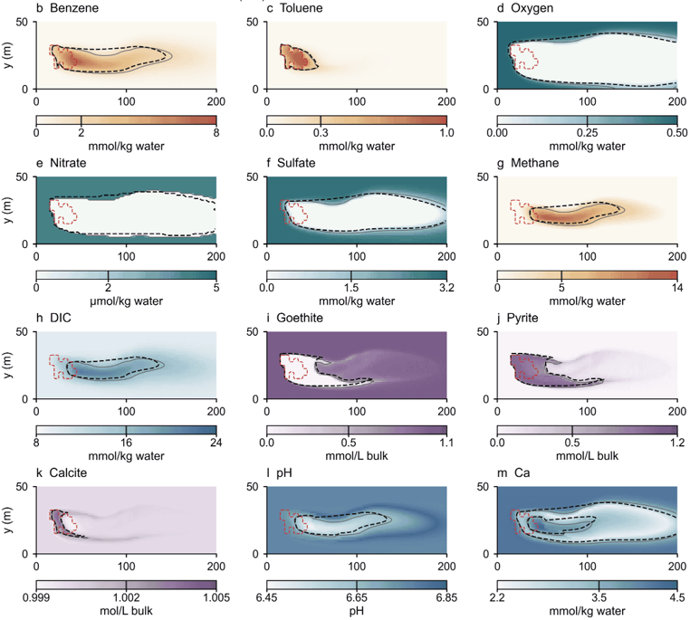
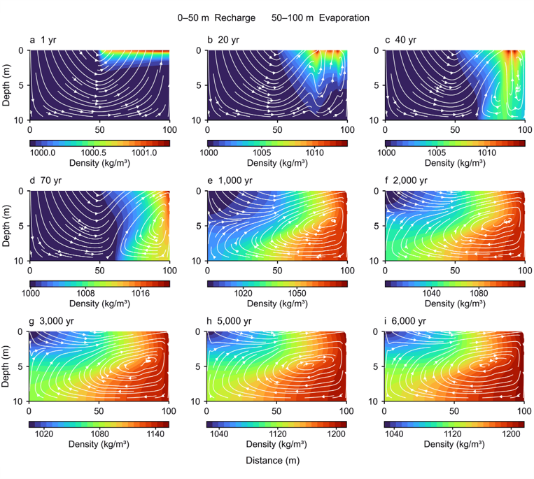
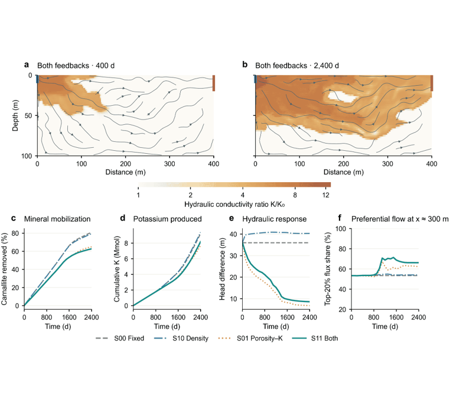
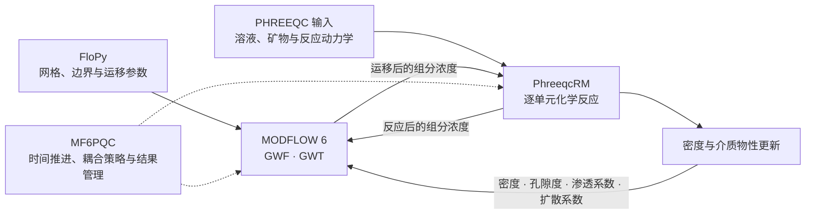

<p align="center">
  
</p>

<h1 align="center">MF6PQC</h1>
<p align="center"><b>连接地下水流动、溶质运移与水–岩反应</b></p>
<p align="center">基于 MODFLOW 6 与 PhreeqcRM 的 Python 反应运移框架</p>

<p align="center">
  <a href="https://pypi.org/project/mf6pqc/"></a>
  <a href="pyproject.toml"></a>
  <a href="https://github.com/MODFLOW-ORG/modflow6/releases/tag/6.8.0"></a>
  <a href="LICENSE"></a>
</p>

<p align="center">
  <a href="#快速开始">快速开始</a> ·
  <a href="#案例与论文图">案例与论文图</a> ·
  <a href="#复现绘图">复现绘图</a> ·
  <a href="#扩展自己的模型">扩展自己的模型</a>
</p>

MF6PQC 将 MODFLOW 6 的地下水流动与溶质运移连接到 PhreeqcRM 的地球化学计算，保留 FloPy 和 PHREEQC 的建模方式。通过 SNIA、SIA 或 Strang 分裂推进时间，并按案例配置更新密度、孔隙度、渗透系数和扩散系数，支持比较不同耦合算法与物性反馈。

<table>
  <tr>
    <th width="33%">非均质反应运移</th>
    <th width="33%">蒸发驱动的密度环流</th>
    <th width="33%">优势通道与反馈响应</th>
  </tr>
  <tr>
    <td align="center" valign="middle"><a href=".github/assets/ex010-reactive-transport.png"></a></td>
    <td align="center" valign="middle"><a href=".github/assets/ex018-density-circulation.png"></a></td>
    <td align="center" valign="middle"><a href=".github/assets/ex021-brine-feedback.png"></a></td>
  </tr>
  <tr>
    <td align="center"><a href="examples/ex010_PHT3D_10/plot.ipynb"><b>ex010 · PHT3D 10</b></a><br/>多组分运移与基准对照</td>
    <td align="center"><a href="examples/ex018_Hamann2015/plot.ipynb"><b>ex018 · Hamann 2015</b></a><br/>盐水羽流与长期密度环流</td>
    <td align="center"><a href="examples/ex021_Brine_Feedback2D/plot.ipynb"><b>ex021 · Brine Feedback</b></a><br/>矿物溶解与水力性质演化</td>
  </tr>
</table>

点击图片查看原图，点击案例名打开绘图 notebook。

## 模型如何连接


```mermaid
flowchart LR
    A["FloPy<br/>网格、边界与运移参数"] --> B["MODFLOW 6<br/>GWF · GWT"]
    C["PHREEQC 输入<br/>溶液、矿物与反应动力学"] --> D["PhreeqcRM<br/>逐单元化学反应"]
    B -->|运移后的组分浓度| D
    D -->|反应后的组分浓度| B
    D --> E["密度与介质物性更新"]
    E -->|密度 · 孔隙度 · 渗透系数 · 扩散系数| B
    F["MF6PQC<br/>时间推进、耦合策略与结果管理"] -.-> B
    F -.-> D
```

| 能力 | 内容 |
| --- | --- |
| 耦合算法 | SNIA、SIA 与 Strang 分裂；可比较精度、迭代次数和计算开销 |
| 化学过程 | 使用 PhreeqcRM 管理 PHREEQC 溶液、平衡相、动力学及其他受支持的反应实体 |
| 密度反馈 | 将化学计算得到的溶液密度传入 MODFLOW 6 的密度耦合路径 |
| 介质演化 | 根据矿物体积变化更新孔隙度，并按配置更新渗透系数和扩散系数 |
| 温度与黏度 | 可选 GWE/VSC 路径；热耦合案例展示温度、反应速率和黏度的相互影响 |
| 结果管理 | 保存组分清单、时间、反应结果及启用的物性；新运行附带环境与输入文件摘要 |

各案例独立设置反馈项。开启某种反馈需要相应的物理假设、参数及 MODFLOW 包配置。

## 快速开始

### 安装 Python 环境

需要 Python 3.11 或更新版本。使用发布的库：

```bash
python -m pip install mf6pqc
```

复现仓库案例时，获取完整仓库并安装案例依赖：

```bash
git clone https://github.com/wangzitao21/mf6pqc.git
cd mf6pqc
python -m pip install -e ".[examples]"
```

### 使用已有结果绘图

如果本地案例已包含保存结果或 `saved_results*.zip` 归档，安装上述案例依赖后即可打开 notebook：

```bash
jupyter lab examples/ex018_Hamann2015/plot.ipynb
```

从第一个单元开始依次执行即可重绘。此流程不运行模型，也无需配置 MODFLOW 动态库；缺少结果时，需要先取得相应归档或按下节运行模型。

### 配置 MODFLOW 6.8.0

从 [USGS 官方 MODFLOW 6.8.0 发布页](https://github.com/MODFLOW-ORG/modflow6/releases/tag/6.8.0) 下载与操作系统相符的发行包，将其中的动态库和可执行文件放到仓库的 `bin/mf6.8.0/`。PyPI 安装不会自动安装 MODFLOW 动态库。

| 操作系统 | 动态库 | 可执行文件 |
| --- | --- | --- |
| Windows | `libmf6.dll` | `mf6.exe` |
| Linux | `libmf6.so` | `mf6` |
| macOS | `libmf6.dylib` | `mf6` |

也可以通过 `MF6PQC_BIN` 指定二进制所在目录，或分别设置 `MF6PQC_LIBMF6` 与 `MF6PQC_MF6_EXE`。例如在 PowerShell 中：

```powershell
$env:MF6PQC_BIN = 'C:\modflow\mf6.8.0\bin'
python examples/ex001_PHT3D_01/run.py
```

案例默认使用 MODFLOW 6.8.0。动态库与可执行文件应来自同一发行包；运行前确认路径与操作系统匹配。

### 运行第一个耦合模型

在仓库根目录执行：

```bash
python examples/ex001_PHT3D_01/run.py
jupyter lab examples/ex001_PHT3D_01/plot.ipynb
```

`run.py` 构建并运行耦合模型，`plot.ipynb` 读取保存结果、绘图并进行数值核对。也可以进入案例目录后执行 `python run.py`。

## 案例与论文图

`examples/` 包含 22 个案例。每个案例根目录统一保留三个文件和三个文件夹：

```text
案例名/
├── modflow_model.py   # 网格、边界、物理参数及 MODFLOW 模型
├── run.py            # 化学初始化、耦合设置与运行入口
├── plot.ipynb        # 结果读取、可视化与数值核对
├── input_data/       # PHREEQC 输入、数据库、初始场与参考数据
├── output/           # 反应与物性结果、无损归档和导出的图
└── simulation/       # MODFLOW 输入、数值输出及无损归档
```

配置与建模函数放在 `modflow_model.py` 或 `run.py`，批量对比逻辑放在 `run.py`，后处理与绘图放在 `plot.ipynb`。案例共用 `examples/` 根目录的 [example_utils.py](examples/example_utils.py)，用于路径定位、读取结果和归档恢复；使用或复制案例时需保留该文件。

| 案例 | 主要内容 | 论文图 |
| --- | --- | --- |
| [ex019_Splitting_KineticDecay1D](examples/ex019_Splitting_KineticDecay1D/plot.ipynb) | 动力学衰减问题中的 SNIA、SIA、Strang 精度与开销 | 图 3 |
| [ex003_PHT3D_03](examples/ex003_PHT3D_03/plot.ipynb) | 含铁碳酸盐体系的一维反应运移 | 图 4 |
| [ex010_PHT3D_10](examples/ex010_PHT3D_10/plot.ipynb) | 非均质含水层中的二维多组分反应运移 | 图 5 |
| [ex018_Hamann2015](examples/ex018_Hamann2015/plot.ipynb) | 蒸发浓缩、密度环流与蒸发岩矿物分带 | 图 6–7 |
| [ex016_Xie2015_B3](examples/ex016_Xie2015_B3/plot.ipynb) | 多矿物反应、孔隙度及水力响应 | 图 8 |
| [ex017_Xie2015_B4](examples/ex017_Xie2015_B4/plot.ipynb) | 矿物分布与有效扩散系数反馈 | 图 9 |
| [ex021_Brine_Feedback2D](examples/ex021_Brine_Feedback2D/plot.ipynb) | 非均质蒸发岩溶浸中的四种反馈组合 | 图 10–12 |
| [ex001_PHT3D_01](examples/ex001_PHT3D_01/plot.ipynb)–[ex013_PHT3D_13](examples/ex013_PHT3D_13/plot.ipynb) | PHT3D 基准系列；各案例保留独立输入和参考数据 | 含上述图 4–5 |
| [ex014_Xie2015_B1](examples/ex014_Xie2015_B1/plot.ipynb)、[ex015_Xie2015_B2](examples/ex015_Xie2015_B2/plot.ipynb) | 矿物反应与水力性质演化的补充对照 | — |
| [ex020_Splitting_RedoxFront2D](examples/ex020_Splitting_RedoxFront2D/plot.ipynb) | 二维氧化还原前沿的分裂误差比较 | — |
| [ex999_Thermal_ReactiveColumn1D](examples/ex999_Thermal_ReactiveColumn1D/plot.ipynb) | 温度、反应与黏度反馈 | — |

图 1–2 为概念与程序结构示意图，不对应独立的案例运行结果。

## 复现绘图

在已有结果齐全时，从第一个单元开始依次执行 `plot.ipynb`。绘图读取本案例的结果和参考数据，论文图导出到 `output/figures/`；重新执行绘图会更新导出的图片。

如果 `output/` 或 `simulation/` 中有 `saved_results*.zip` 归档，notebook 会先恢复缺失文件，再读取数组、水头或流量预算，保留已经存在的结果。仅重绘无需启动 MODFLOW 或 PHREEQC；没有保存结果时，需先取得对应归档或运行案例。

重新计算时先执行案例的 `run.py`，再运行 `plot.ipynb`。Hamann、Xie、PHT3D 11–13 和卤水案例计算量较大，可优先用已有结果检查绘图。历史归档对应原始运行配置，重新绘图不会改变其求解器版本或数值结果。

`results_headings.txt` 给出变量顺序，`results_times.npy` 或案例专用时间文件给出保存时刻。例如 Hamann 的旧结果使用 `result_times_years.npy`，绘图代码兼容以年保存的时间。矿物体积基准、浓度和密度单位以各 notebook 中的转换为准；PHT3D、MIN3P 等参考结果来自案例中的对照数据。

### 卤水案例的四种情景

| 标签 | 密度反馈 | 孔隙度–渗透系数反馈 |
| --- | :---: | :---: |
| S00 | 关闭 | 关闭 |
| S10 | 开启 | 关闭 |
| S01 | 关闭 | 开启 |
| S11 | 开启 | 开启 |

```bash
# 依次执行四种情景；相同配置且已完成的标签会直接复用。
python examples/ex021_Brine_Feedback2D/run.py

# 单独创建一个新标签，保留原情景结果。
python examples/ex021_Brine_Feedback2D/run.py --scenario S11 --label S11_repeat --threads 2

# 从现有四种情景的结果重绘论文图。
jupyter lab examples/ex021_Brine_Feedback2D/plot.ipynb
```

该案例采用固定体积、准稳态水力调整与经验孔隙度–渗透系数关系。其边界、化学体系、质量核对和适用范围在笔记本中说明。

## 扩展自己的模型

在 `examples/` 下复制一个物理过程接近的完整案例目录，例如命名为 `ex022_MyCase`，与公共文件 `example_utils.py` 保持同级。复制后，先同步修改 Python 中的案例包导入和 notebook 中的 `CASE_NAME`，再依次调整：

1. 在 `modflow_model.py` 中设置网格、边界、水力参数、时间离散和运移包。
2. 在 `input_data/` 中配置化学数据库、PHREEQC 输入、初始场与对照数据。
3. 在 `run.py` 中设置化学分区、组分映射、耦合算法和物性反馈。
4. 在 `plot.ipynb` 中核对时间、单位、守恒关系及参考误差，再解释模型结果。

网格单元数、浓度排列、化学分区及保存时刻需要彼此一致。比较算法或反馈机制时，应明确保持哪些输入和边界相同。

## 检查与依赖

```bash
# 检查全部案例的目录、Python/笔记本语法及受保护导入，不运行模型。
python scripts/check_examples.py

# 对选定案例进行独立回归计算，结果写入指定目录。
python scripts/check_examples.py --native ex001_PHT3D_01 ex008_PHT3D_08 --output-root .release-checks/native
```

静态检查不执行 `main()` 或 notebook，也不运行求解器；验证完整绘图需执行对应 notebook。只有显式指定 `--native` 才会运行模型，支持 PHT3D 01–10、两个分裂算法案例和热耦合案例。其他案例通过各自的 `run.py` 启动。完整依赖与版本范围见 [pyproject.toml](pyproject.toml)。

## 许可与引用

MF6PQC 采用 [GPL-3.0-only](LICENSE) 许可。MODFLOW 6、PhreeqcRM、化学数据库与基准研究分别保留其作者归属和适用条款。研究中使用本项目时，请注明所用版本，并引用相应求解器及具体案例的原始文献。

- [MF6PQC 源代码与版本](https://github.com/wangzitao21/mf6pqc)
- [MODFLOW 6.8.0 软件引用](https://doi.org/10.5066/P1PGE9XW)
- [问题反馈](https://github.com/wangzitao21/mf6pqc/issues)
