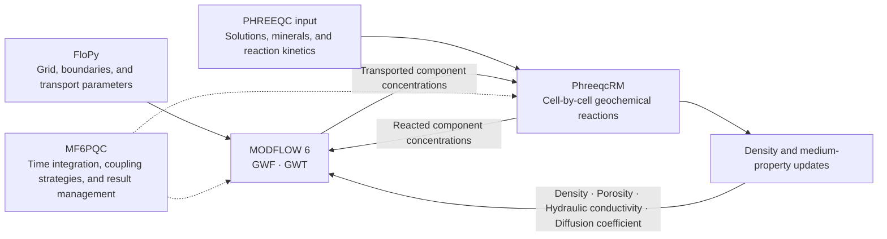

<p align="center">
  
</p>
<p align="center">A modular MODFLOW 6–PhreeqcRM framework for variable-density reactive transport with evolving porosity and hydraulic conductivity</p>

<p align="center">
  <a href="https://pypi.org/project/mf6pqc/"></a>
  <a href="pyproject.toml"></a>
  <a href="https://github.com/MODFLOW-ORG/modflow6/releases/tag/6.8.0"></a>
  <a href="LICENSE"></a>
</p>

<p align="center">
  <a href="#quick-start">Quick Start</a> ·
  <a href="#examples-and-publication-figures">Examples & Publication Figures</a> ·
  <a href="#extending-your-own-model">Extend Your Own Model</a>
</p>

MF6PQC couples groundwater flow and solute transport in MODFLOW 6 with geochemical calculations in PhreeqcRM while preserving the familiar modeling workflows of FloPy and PHREEQC. Time integration is performed using SNIA, SIA, or Strang splitting. Depending on the configuration of each example, density, porosity, hydraulic conductivity, and diffusion coefficients can be updated dynamically, enabling comparisons of different coupling algorithms and physical-property feedback mechanisms.

<table>
  <tr>
    <th width="33%">Heterogeneous Reactive Transport</th>
    <th width="33%">Evaporation-Driven Density Circulation</th>
    <th width="33%">Preferential Pathways and Feedback Response</th>
  </tr>
  <tr>
    <td align="center" valign="middle"><a href=".github/assets/ex010-reactive-transport.png"></a></td>
    <td align="center" valign="middle"><a href=".github/assets/ex018-density-circulation.png"></a></td>
    <td align="center" valign="middle"><a href=".github/assets/ex021-brine-feedback.png"></a></td>
  </tr>
  <tr>
    <td align="center"><a href="examples/ex010_PHT3D_10/plot.ipynb"><b>ex010 · PHT3D 10</b></a><br/>Multicomponent transport and benchmark comparison</td>
    <td align="center"><a href="examples/ex018_Hamann2015/plot.ipynb"><b>ex018 · Hamann 2015</b></a><br/>Brine plume and long-term density circulation</td>
    <td align="center"><a href="examples/ex021_Brine_Feedback2D/plot.ipynb"><b>ex021 · Brine Feedback</b></a><br/>Mineral dissolution and evolution of hydraulic properties</td>
  </tr>
</table>

Click an image to view it at full resolution, or click an example name to open its plotting notebook.

## How the Models Are Coupled


```mermaid id="mf6pqc-coupling"
flowchart LR
    A["FloPy<br/>Grid, boundaries, and transport parameters"] --> B["MODFLOW 6<br/>GWF · GWT"]
    C["PHREEQC input<br/>Solutions, minerals, and reaction kinetics"] --> D["PhreeqcRM<br/>Cell-by-cell geochemical reactions"]
    B -->|Transported component concentrations| D
    D -->|Reacted component concentrations| B
    D --> E["Density and medium-property updates"]
    E -->|Density · Porosity · Hydraulic conductivity · Diffusion coefficient| B
    F["MF6PQC<br/>Time integration, coupling strategies, and result management"] -.-> B
    F -.-> D
```

| Capability                | Description                                                                                                                                                              |
| ------------------------- | ------------------------------------------------------------------------------------------------------------------------------------------------------------------------ |
| Coupling algorithms       | SNIA, SIA, and Strang splitting; supports comparisons of accuracy, iteration counts, and computational cost                                                              |
| Geochemical processes     | Uses PhreeqcRM to manage PHREEQC solutions, equilibrium phases, kinetics, and other supported reaction entities                                                          |
| Density feedback          | Passes solution density calculated by the geochemical model to the MODFLOW 6 density-coupling pathway                                                                    |
| Medium evolution          | Updates porosity based on changes in mineral volume and, when configured, updates hydraulic conductivity and diffusion coefficients                                      |
| Temperature and viscosity | Optional GWE/VSC pathways; thermal-coupling examples (under active development) demonstrate interactions among temperature, reaction rates, and viscosity                |
| Result management         | Stores component lists, simulation times, reaction results, and enabled physical properties; new runs include summaries of the computational environment and input files |

Feedback mechanisms are configured independently for each example. Enabling a particular feedback mechanism requires the corresponding physical assumptions, parameters, and MODFLOW package configuration.

## Quick Start

### Install the Python Environment

Python 3.11 or later is required. To install the released package:

```bash id="install-mf6pqc"
python -m pip install mf6pqc
```

> PhreeqcRM 0.0.17 is currently recommended because we have observed reduced native multithreading performance with PhreeqcRM 0.0.18 in Python/OpenMP configurations due to GIL lock contention. Although this issue can be mitigated using mf6pqc's `parallel.py`, we still recommend PhreeqcRM 0.0.17 for the current release.

To reproduce the examples included in this repository, clone the full repository and install the example dependencies:

```bash id="install-examples"
git clone https://github.com/wangzitao21/mf6pqc.git
cd mf6pqc
python -m pip install -e ".[examples]"
```

### Configure MODFLOW 6

mf6pqc supports the latest MODFLOW 6 release, version 6.8.0. Download the appropriate distribution for your operating system from the [official USGS MODFLOW 6.8.0 release page](https://github.com/MODFLOW-ORG/modflow6/releases/tag/6.8.0), and place the dynamic library and executable in the repository's `bin/mf6.8.0/` directory. Installing mf6pqc from PyPI does not automatically install the MODFLOW dynamic library.

| Operating System | Dynamic Library | Executable |
| ---------------- | --------------- | ---------- |
| Windows          | `libmf6.dll`    | `mf6.exe`  |
| Linux            | `libmf6.so`     | `mf6`      |
| macOS            | `libmf6.dylib`  | `mf6`      |

Alternatively, use `MF6PQC_BIN` to specify the directory containing the binaries, or set `MF6PQC_LIBMF6` and `MF6PQC_MF6_EXE` separately. For example, in PowerShell:

```powershell id="configure-mf6"
$env:MF6PQC_BIN = 'C:\modflow\mf6.8.0\bin'
python examples/ex001_PHT3D_01/run.py
```

### Run an Example

Using the first example in the repository, run the following commands from the repository root:

```bash id="run-example"
python examples/ex001_PHT3D_01/run.py
jupyter lab examples/ex001_PHT3D_01/plot.ipynb
```

Alternatively, enter the example directory and run `python run.py`.

## Examples and Publication Figures

The `examples/` directory contains 22 examples. Each example directory follows a consistent structure with three files and three subdirectories:

```text id="example-structure"
example_name/
├── input_data/       # PHREEQC input, databases, initial fields, and reference data
├── simulation/       # MODFLOW 6 input, numerical output, and lossless archives
├── output/           # Reaction and physical-property results, lossless archives, and exported figures
├── modflow_model.py  # Grid, boundaries, physical parameters, and MODFLOW model
├── run.py            # Geochemical initialization, coupling configuration, and simulation entry point
└── plot.ipynb        # Result loading, visualization, and numerical validation
```

Configuration and modeling functions are placed in `modflow_model.py` or `run.py`, batch-comparison logic is placed in `run.py`, and post-processing and plotting are handled in `plot.ipynb`. The examples share [example_utils.py](examples/example_utils.py) in the root of the `examples/` directory for path resolution, result loading, and archive restoration.

## Extending Your Own Model

Under `examples/`, copy a complete example directory representing a similar physical process and rename it, for example, `ex022_MyCase`. Keep the new directory at the same level as the shared `example_utils.py` file. After copying the example, modify the following:

1. Configure the model grid, boundary conditions, hydraulic parameters, time discretization, and transport packages in `modflow_model.py`.
2. Configure the geochemical database, PHREEQC input, initial fields, and reference data in `input_data/`.
3. Configure geochemical zoning, component mapping, the coupling algorithm, and physical-property feedback in `run.py`.
4. Use `plot.ipynb` to verify simulation times, units, conservation relationships, and errors relative to reference results before interpreting the model output.

The number of grid cells, concentration-array layout, geochemical zoning, and saved output times must remain mutually consistent. When comparing algorithms or feedback mechanisms, clearly define which inputs and boundary conditions are held constant.

## License and Citation

MF6PQC is licensed under [GPL-3.0-only](LICENSE). MODFLOW 6, PhreeqcRM, geochemical databases, and benchmark studies retain their respective authorship attribution and applicable terms.

* [MF6PQC source code and releases](https://github.com/wangzitao21/mf6pqc)
* [MODFLOW 6.8.0 software citation](https://doi.org/10.5066/P1PGE9XW)
* [Issue tracker](https://github.com/wangzitao21/mf6pqc/issues)
